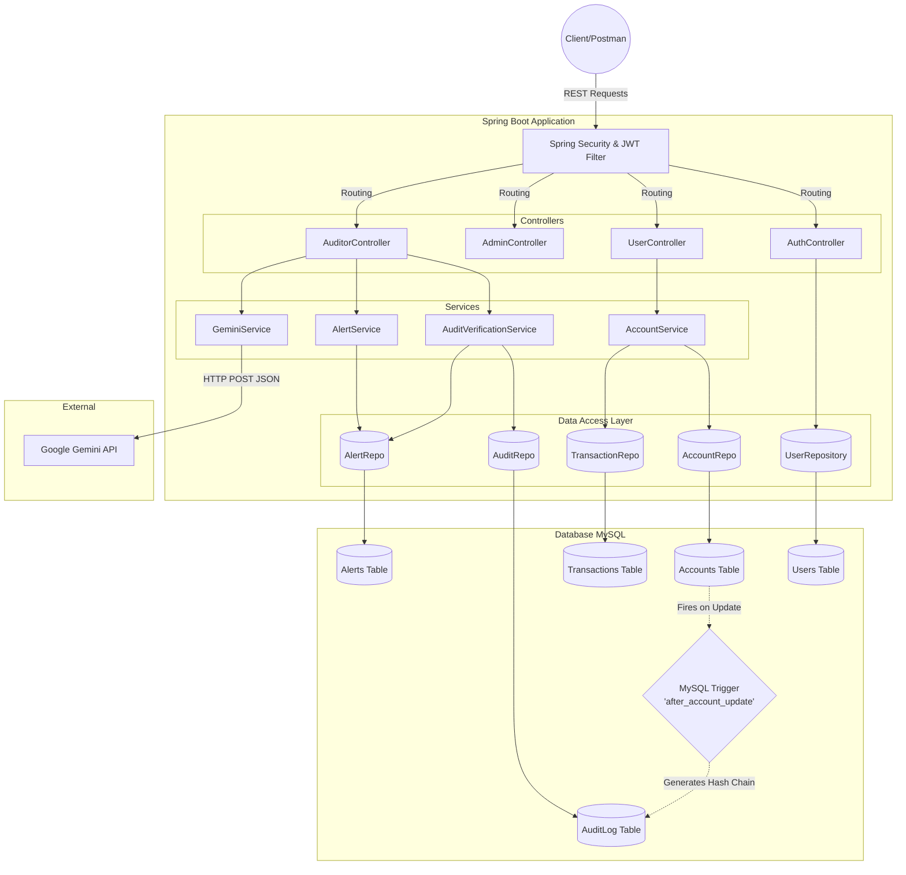

# AuditChain Architecture Diagram

## Data Flow (Tamper-Evident Transaction)
1. **Initiate Transfer**: `UserController` -> `AccountService` 
2. **Account Updates**: `AccountService` saves updated sender/receiver balances. 
3. **Database Trigger**: MySQL `after_account_update` catches the row change.
4. **Hash Chain Generation**: The trigger strings together the `record_id`, `new_balance`, and `last_row_hash`.
5. **Secure Log Created**: Trigger inserts the compiled string hash and old/new JSON data into `AuditLog`.
6. **Verification Request**: Auditor queries `AuditorController`.
7. **Hash Verification Check**: `AuditVerificationService` rebuilds hashes from scratch and compares against stored DB values.
8. **AI Alerting**: If verification fails, an `Alert` is saved. The `GeminiService` grabs the alerts and sends them to the Gemini API for plain English translation.
